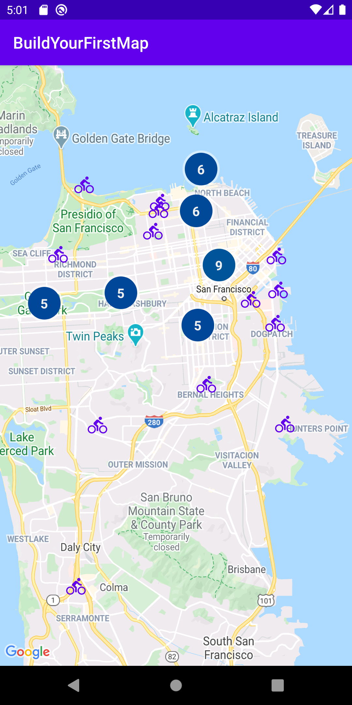

Google Maps Platform 101: Android Codelab
=========================================

## Description
Accompanying starter and solution code for the [Google Maps Platform 101: Android Codelab][codelab], a codelab that teaches you how to integrate Maps SDK for Android into your app and use its core features.

## Requirements
* Android Studio 3.6 or higher

## Support
If you find a bug, please [file an issue]. Or, if you'd like to contribute, send us a [pull request] and refer to our [code of conduct].

[codelab]: https://codelabs.developers.google.com/codelabs/maps-platform-101-android/index.html
[file an issue]: https://github.com/googlecodelabs/maps-platform-101-android/issues
[pull request]:  https://github.com/googlecodelabs/maps-platform-101-android/compare
[code of conduct]: CODE_OF_CONDUCT.md
